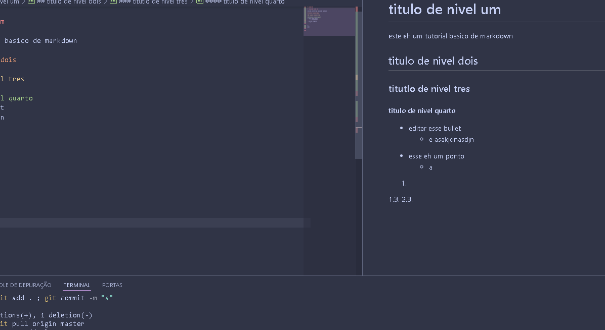

# aula3-pet

# titulo de nivel um

este eh um tutorial basico de markdown 

## titulo de nivel dois

### titutlo de nivel tres

#### titulo de nivel quarto 
* editar esse ´bullet´
    * e asakjdnasdjn 
    
- esse eh um ponto
    - a 

1.
1.3.
2.3.

